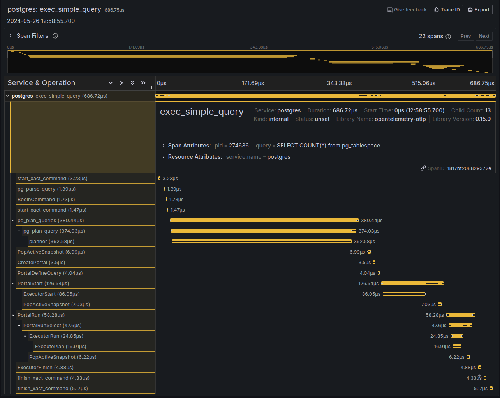

<div align="center">

# PG Ferret

All-in-one tracing toolkit for Postgres. Batteries included.


[](https://hub.docker.com/r/cbellew/pg-ferret/tags)
[](https://github.com/ChrisBellew/pg-ferret/blob/main/LICENSE)



</div>

## Features

🔍️ Observe traces of your queries inside Postgres

🔥 Correlate Postgres query spans with your application spans

⚡️ Low overhead auto-instrumentation with eBPF. Rust in the kernel and userspace [Obligatory _blazingly fast_].

🗃️ Built in trace storage with Grafana Tempo and trace visualisation with Grafana. Or bring your own OpenTelemetry backend (Grafana Tempo, Jaeger, Zipkin, Honeycomb, Datadog, etc).

📦 Special debug build of Postgres included. Small (currently unmeasured) performance overhead

🛠️ Intended for non-production use in debugging slow queries

🚀 Built with 💛 using the power of Rust and [Aya](https://github.com/aya-rs/aya)

## Why

- Postgres has various plugins which provide aggregated metrics into queries and locks. These are very useful, but don't tell the full story of a query path in Postgres.
- Knowing more about the internals of Postgres helps make us better engineers.
- Tracing is the gold standard of observability. PG Ferret aims to bring Postgres tracing to the masses.

## Usage

### Quick start

To give it a spin, try the all-in-one Docker image. This creates a container with Postgres, PG Ferret, Grafana Tempo and Grafana inside. Use it just like a normal Postgres container. You will need to run it in privileged mode for eBPF to work though.

#### 1. Start the all-in-one container

```sh
docker pull cbellew/pg-ferret-all-in-one:latest &&
docker run -it \
  -e POSTGRES_DB=mydb \
  -e POSTGRES_USER=myuser \
  -e POSTGRES_PASSWORD=mypass \
  --privileged -p 5432:5432 -p 3000:3000 \
  cbellew/pg-ferret-all-in-one:latest
```

#### 2. Wait a second and fire a test query

```sh
docker run --rm \
  -e PGPASSWORD=mypass \
  --network=host \
  postgres:16 \
  /usr/lib/postgresql/16/bin/psql -U myuser -h localhost -p 5432 -d mydb -c \
  "SELECT COUNT(*) FROM pg_tablespace"
```

#### 3. [Open Grafana](http://localhost:3000/explore?left=%7B%22datasource%22%3A%22tempo%22%2C%22queries%22%3A%5B%7B%22queryType%22%3A%22traceqlSearch%22%7D%5D%7D) to check out the traces.

### Slim image - bring your own tracing backend

The all-in-one image provides Grafana and Tempo built in, but if you have your own tracing backend you can use the slim PG Ferret image which just has Postgres and PG Ferret built in. Configure the `OTEL_TRACING_ENDPOINT` env var send PG Ferret will send traces there in OTLP format.

#### 1. Start the slim image

```sh
docker pull cbellew/pg-ferret:latest &&
docker run -it \
  -e POSTGRES_DB=mydb \
  -e POSTGRES_USER=myuser \
  -e POSTGRES_PASSWORD=mypass \
  -e OTEL_TRACING_ENDPOINT=http://myoteltracingbackend:4317 \
  --privileged -p 5432:5432 \
  cbellew/pg-ferret:latest
```

#### 2. Wait a second and fire a test query

```sh
docker run --rm \
  -e PGPASSWORD=mypass \
  --network=host \
  postgres:16 \
  /usr/lib/postgresql/16/bin/psql -U myuser -h localhost -p 5432 -d mydb -c \
  "SELECT COUNT(*) FROM pg_tablespace"
```

## How it works

- eBPF is a special runtime that allows sandboxed programs to run in the kernel. One use of eBPF is to have a kernel program attach to parts of code running in userspace (your programs), allowing enhanced observability without running a special debugger. PG Ferret uses eBPF to attach to Postgres which is also running in userspace.
- The eBPF loader needs the memory address of each function you want to attach to. These are commonly sought from the _debugging symbols_ which are produced when a program is built, and provide a mapping from function name to memory address in the compiled executable. Debugging symbols can be embedded within the executable itself and if so, the eBPF loader has everything it needs to inject the eBPF program into the kernel and it attach it to the relevant functions.
- PG Ferret embeds a simple program into the kernel which attaches to a few dozen key functions inside Postgres.
- In a standard build of Postgres the debugging symbols are partially or fully stripped, which is unhelpful for eBPF, so PG Ferret ships with a special build of Postgres with these symbols intact.
